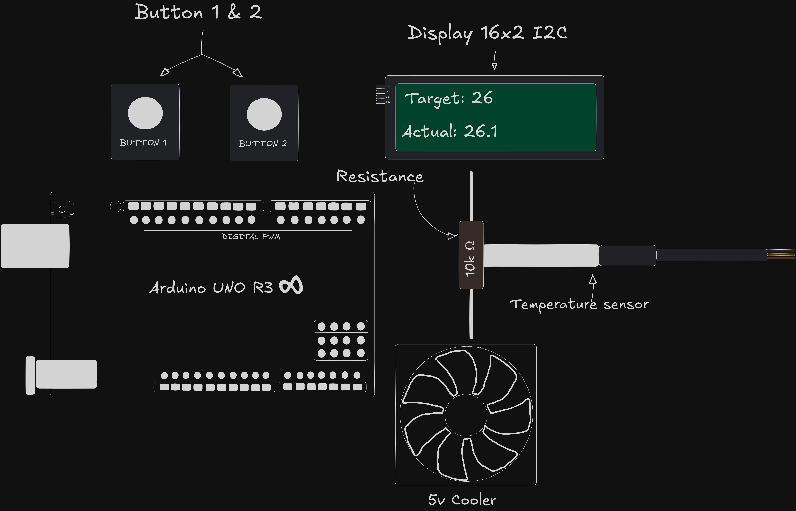

Perform hysteresis with an Arduino based on a counter.

Components:
- Arduino Uno R3
- Resistance
- 16x2 display
- Power supply
- 5v cooler
- 2 buttons

Representation in drawing (I'm a developer not an artist)
Embedded systems class project

https://github.com/user-attachments/assets/d58d71fe-7219-4d28-8ae3-5e97dfb183c7

Video
